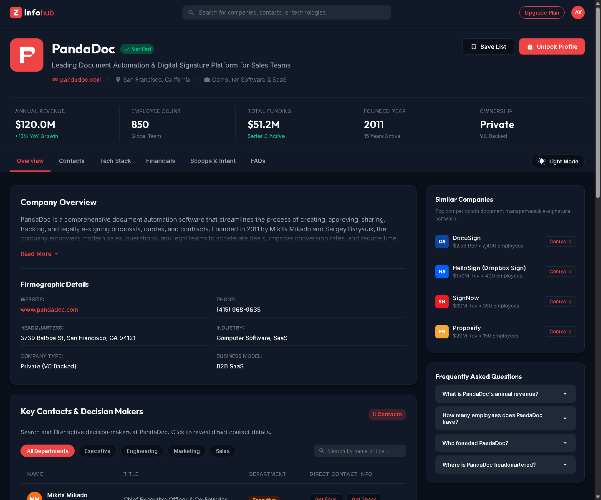
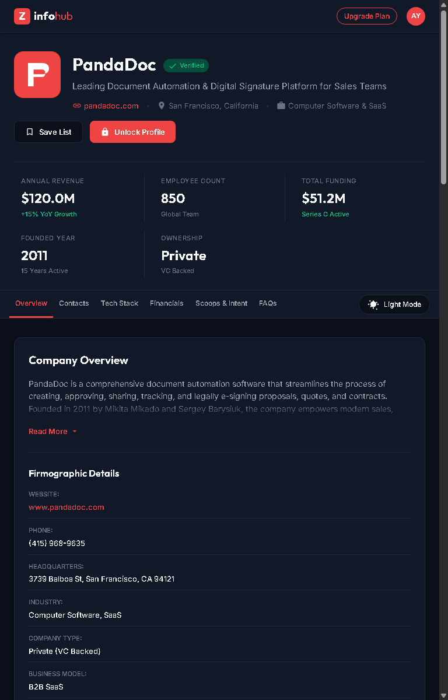
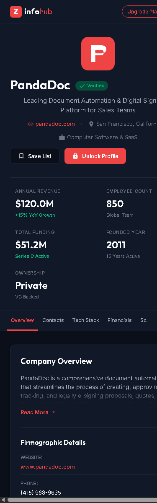

# ZoomInfo Company Profile Rebuild

A high-fidelity, pixel-perfect, and fully responsive rebuild of the ZoomInfo Company Profile page template (inspired by PandaDoc's profile page). Built using modern frontend technologies to showcase dynamic interactivity, premium aesthetics, and responsive layout structures.

## 🚀 Live Demo & Repository
- GitHub Repository: [https://github.com/amit1223yadav/ATGN](https://github.com/amit1223yadav/ATGN)

---

## 📸 Screenshots

### 🖥️ Desktop Width (1440px)


### 📟 Tablet Width (768px)


### 📱 Mobile Width (375px)


---

## ✨ Features

1. **Fully Responsive Layout Structure**:
   - Resizes smoothly across Ultra-Wide, Desktop, Tablet, and Mobile breakpoints.
   - Zero horizontal scrolling on any mobile screen width (hard-clipped viewport boundary safety).
   - Touch-scrollable navigation sub-bar and filter tabs on mobile viewport.

2. **🌓 Synced Theme Switcher (Dark & Light Mode)**:
   - Synchronized toggle buttons present in both the main navbar (desktop/tablet) and the hamburger menu drawer (mobile).
   - Remembers user theme preferences using `localStorage`.

3. **🔓 Custom Unlock Profile Overlay Modal**:
   - A modern split-panel sign-in and registration layout containing tabbed forms, password toggles, Work Email validation, and Google/Microsoft OAuth options.

4. **📌 Save List Management Panel**:
   - Dynamic popup that allows selecting target list collections using checkboxes with visual highlights, or instantly creating new list chips with inline inputs.

5. **🍞 Premium Animated Toast Notification System**:
   - Stacking, slide-in alerts with Variant theme accents (Success, Info, Warning, Error), custom SVG icons, interactive hover-to-pause countdowns, and dynamic progress timers.

6. **🔍 Live Contact Filtering & Tech Stack Badging**:
   - Real-time client-side search input filter matches contacts by name/title and highlights matching technographics.

7. **💳 Interactive Modal Overlays**:
   - Membership plans overview popups and Profile/Settings panels complete with interactive tabs.

---

## 🛠️ Tech Stack
- **Core Engine**: [Vite](https://vite.dev/)
- **Structure**: Semantic HTML5 Markup
- **Styling**: Vanilla CSS + [Tailwind CSS v4](https://tailwindcss.com/)
- **Logic**: Vanilla JS (ES6 Module Architecture)

---

## 💻 Getting Started Locally

### 1. Clone the repository
```bash
git clone https://github.com/amit1223yadav/ATGN.git
cd ATGN
```

### 2. Install dependencies
```bash
npm install
```

### 3. Run the development server
```bash
npm run dev
```

Open [http://localhost:5173](http://localhost:5173) in your browser.

### 4. Build for production
```bash
npm run build
```
The compiled output will be generated inside the `dist/` directory.
